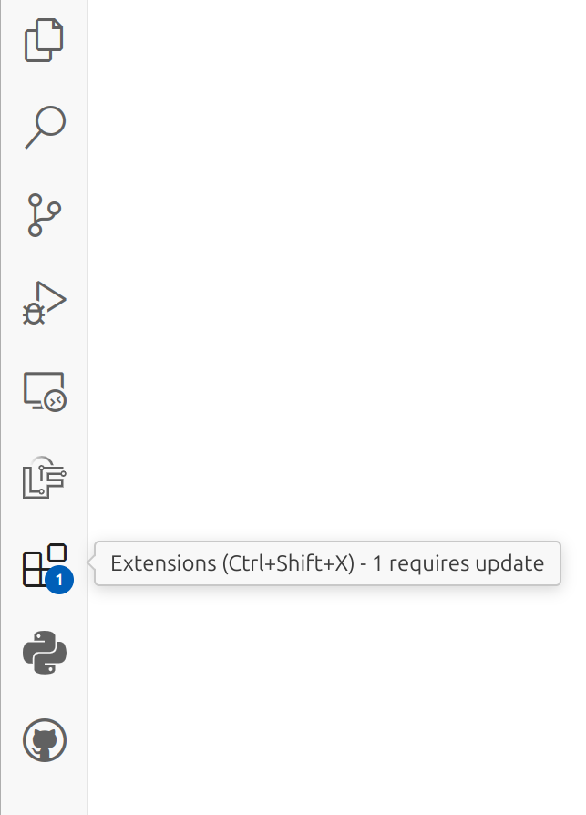
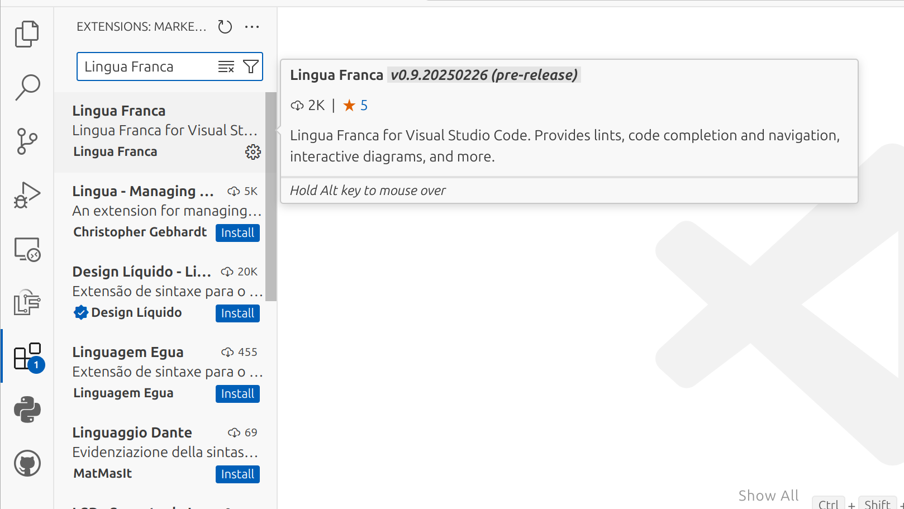
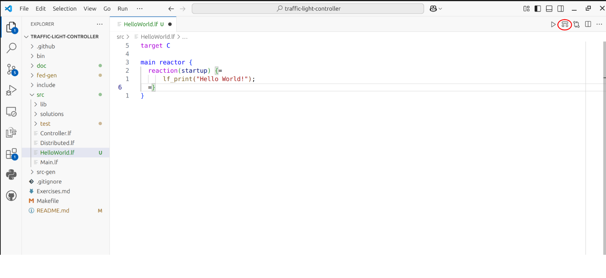
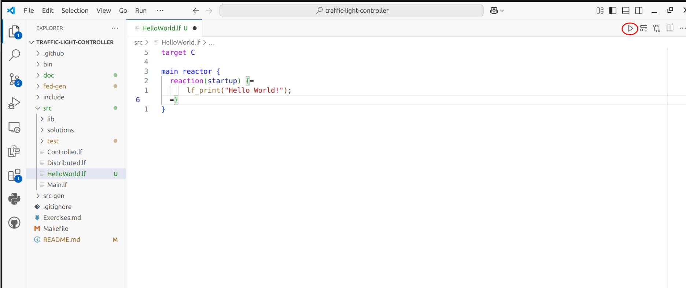

# LF Traffic Light Controller
Build a Lingua Franca based traffic light controller! Go directly to the exercises [here](Exercises.md)


## Prerequisites
- Linux, macOS or Windows Subsystem for Linux (WSL). 
- A Ubuntu VM with everything installed can also be downloaded [here](https://drive.google.com/file/d/1KwzQl56MlyBVLrJKngAE6ahd7eTb2c8X/view?usp=sharing)
- git
- A C compiler such as `gcc` or `clang`
- A recent version of `cmake`
- GNU make
- Java 17 (or greater)
  - Ubuntu: `sudo apt install openjdk-17-jdk`
  - macOS `brew install openjdk@17` or `sudo port install openjdk17`

For more information on the prerequisites, see https://www.lf-lang.org/docs/installation

## Getting started

### 1. Clone this repo

```sh
git clone git@github.com:erlingrj/lf-traffic-light.git
```

or 

```sh
git clone https://github.com/erlingrj/lf-traffic-light.git
```

### 2. VSCode extension (recommended)
Install Microsoft VSCode (https://code.visualstudio.com/).

Open the cloned repo in VSCode, e.g. in the same terminal as
you ran the git clone command, do:
```sh
code lf-traffic-light
```

Navigate to the Extension Marketplace:



Find and install the Lingua Franca extension:



Open [HelloWorld.lf](src/HelloWorld.lf)

Inspect the auto-generated diagram by pressing this button:


And run the program by pressing the Play button


The program output is printed to the integrated terminal.

### 2. Command-line tools (optional)

If you have installed VSCode and the extension, you can skip this section.

If you wish to use another code editor, or just want to
interact directly with the command line tools, they can
be installed by our convenience install script:

```sh
curl -Ls https://install.lf-lang.org | bash -s cli
```

This will install `lfc` to `$HOME/.local/bin`, make sure this is on your system path, e.g. by 
adding the following to the end of your `~/.bashrc`

```bash
export PATH=$PATH:$HOME/.local/bin
```

Now you can manually compile the [HelloWorld.lf](src/HelloWorld.lf) from the command line with:
```sh
lfc src/HelloWorld.lf
```

Run the resulting binary with
```sh
bin/HelloWorld
```

Generate the diagram by:
```sh
lfd src/HelloWorld.lf
```

This will produce an SVG called HelloWorld.svg.

Finally, you can verify that everything is correctly 
installed with:
```sh
make all
``` 

### 2. Ubuntu VM (If nothing else works)
Download a preconfigured Ubuntu VM [here](https://drive.google.com/file/d/1KwzQl56MlyBVLrJKngAE6ahd7eTb2c8X/view?usp=sharing)
The username and password are both `ubuntu`.

After logging in, fetch the most recent changes to the tutorial and verify the setup.

```sh
cd ~/lf-traffic-light
git pull
make all
```

VScode will be installed with the Lingua Franca extension so you can interact with the auto-synthesized diagrams.


## Exercises
Now that your setup is done and verified you can move on to the actual [exercises](Exercises.md)

