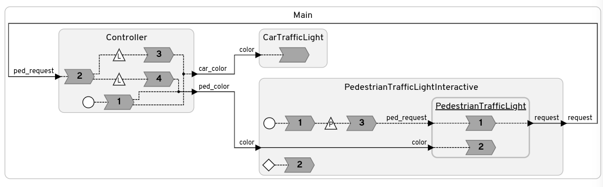

# LF Traffic Light Controller
Build an Lingua Franca-based traffic light controller!



## Prerequisits
- A Linux or MacOS OS or download a VM [here](https://drive.google.com/file/d/1KwzQl56MlyBVLrJKngAE6ahd7eTb2c8X/view?usp=sharing)
- git
- A C compiler such as `gcc` or `clang`
- A recent version of `cmake`
- Java 17 (or greater) (`sudo apt install openjdk-17-jdk` or `brew install openjdk@17`)

## Getting started (native)

### Install the Lingua Franca Compiler

```sh
curl -Ls https://install.lf-lang.org | bash -s cli
```

This will install `lfc` to `$HOME/.local/bin`, make sure this is on your system path, e.g. by 
adding the following to the end of your `~/.bashrc`

```bash
export PATH=$PATH:$HOME/.local/bin
```


### Clone this repo

```sh
git clone git@github.com:erlingrj/lf-traffic-light.git
```

or 

```sh
git clone https://github.com/erlingrj/lf-traffic-light.git
```

### Verify tool setup
```sh
make all
```

### Editor support (optional)
Although any text editor will work, we recommend to use VSCode. A Lingua Franca extension can be
installed either by searching for "Lingua Franca" on the Extension Marketplace, or run the following
command from a terminal

```sh
code --install-extension lf-lang.vscode-lingua-franca
```


## Getting started (VM)
Download a preconfigured Ubuntu VM [here](https://drive.google.com/file/d/1KwzQl56MlyBVLrJKngAE6ahd7eTb2c8X/view?usp=sharing)
The username and password is both `ubuntu`.

After logging in, fetch the most recent changes to the tutorial and verify the setup.

```sh
cd ~/lf-traffic-light
git pull
make all
```


